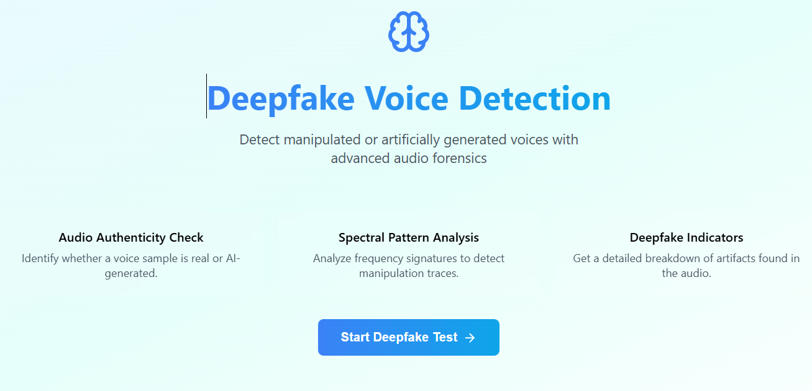
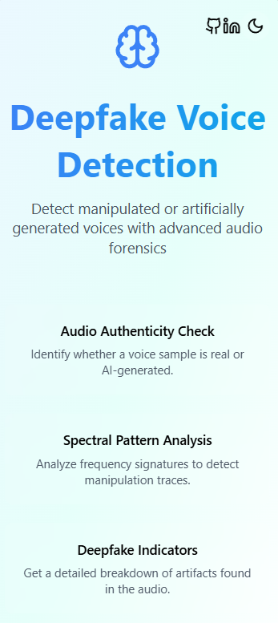
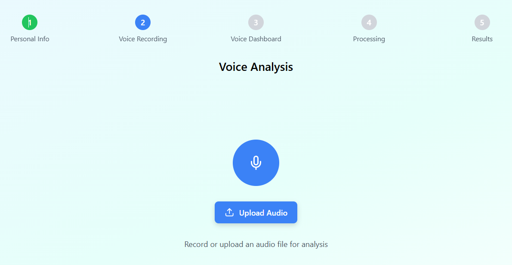
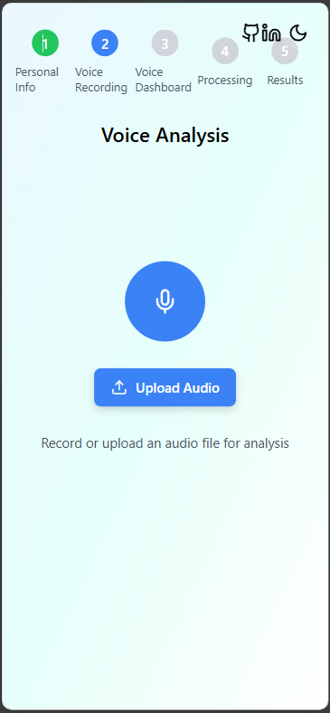
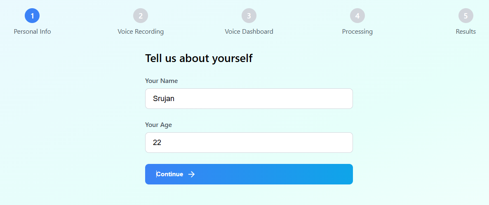
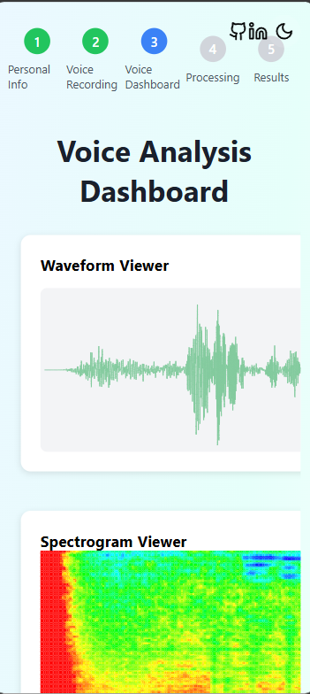
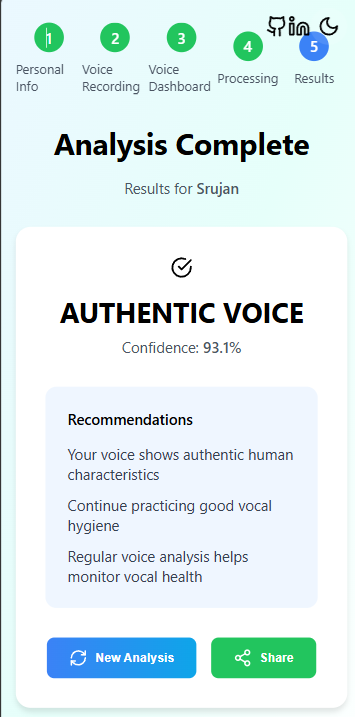
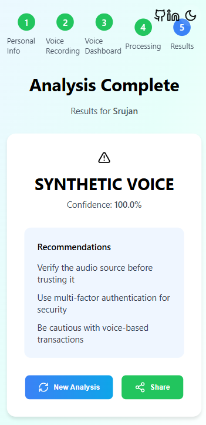

# 🎙️ Deepfake Voice Detection  
**An End-to-End Audio Forensics & Detection Pipeline**

---

## 📌 Overview

This repository contains a research-driven, end-to-end **Deepfake Voice Detection** system that integrates audio signal processing, deep learning, and backend deployment to identify whether a voice sample is **authentic or synthetically generated**.

The project is designed as a complete ML pipeline, extending from raw audio ingestion to confidence-based predictions.  
A fully functional frontend application has also been developed and is available **upon request**.

---

## 📑 Table of Contents

- [Overview](#-overview)
- [Key Features](#-key-features)
- [System Architecture](#-system-architecture)
- [Dataset](#-dataset)
- [Audio Processing Pipeline](#-audio-processing-pipeline)
- [Modeling Approach](#-modeling-approach)
- [Web Application](#-web-application)
- [User Interface Preview](#-user-interface-preview)
- [Backend Service](#-backend-service)
- [Frontend Availability](#-frontend-availability)
- [Results & Performance](#-results--performance)
- [Limitations](#-limitations)
- [Repository Structure](#-repository-structure)
- [Installation & Usage](#-installation--usage)
- [References](#-references)
- [Final Note](#-final-note)
- [Contact](#-contact)


---

## ✨ Key Features

- CNN-based deepfake voice detection  
- MFCC-driven audio representation  
- End-to-end ML inference pipeline  
- Audio preprocessing and feature extraction  
- Confidence-based binary classification  
- Backend API for model serving  
- Frontend application (private / on request)  

---

## 🏗️ System Architecture

```
Audio Input
  ↓
Preprocessing (Librosa)
  ↓
MFCC Feature Extraction
  ↓
CNN-Based Classifier
  ↓
Prediction + Confidence Score
  ↓
Backend API (Flask)
  ↓
Frontend Application (Private)
```

This architecture bridges **research-grade modeling** with **deployment-ready system design**.

---


---

## 📂 Dataset

- **Dataset:** SceneFake
- **Audio Format:** 16 kHz, 16-bit, mono WAV

### Classes
- Real (bona fide speech)
- Fake (synthetic / manipulated speech)

### Dataset Split

| Split | Files |
|------|-------|
| Train | 13,185 |
| Dev | 12,843 |
| Eval | 32,746 |

Class imbalance in the training set is handled using **SMOTE**.

---

## 🎛️ Audio Processing Pipeline

Each audio sample undergoes:

- Loading and resampling (16 kHz)
- Mono conversion
- Silence trimming (optional)
- Amplitude normalization
- Feature extraction:
  - MFCCs
  - Spectrograms
  - Pitch and silence statistics

These steps ensure **robust and consistent** model inputs.

---

## 🤖 Modeling Approach

### CNN-Based Deepfake Classifier

- **Input:** MFCC feature maps
- **Architecture:**
  - Conv1D layers with ReLU activation
  - Dropout for regularization
  - MaxPooling
  - Softmax output (Real vs Fake)
- **Optimizer:** Adam
- **Loss:** Sparse Categorical Cross-Entropy

The deployed model achieves **~80–85% accuracy** on unseen data.

> Classical ML baselines (Random Forest, KNN) are explored in the accompanying research report.

---

## 🌐 Web Application

### Backend
- **Framework:** Flask
- Handles audio ingestion, preprocessing, inference, and response generation

### Frontend
- **React (JavaScript)**
- **Vanilla CSS**

#### Features
- Step-based user flow
- Audio recording & upload
- Visual audio analytics
- Clear prediction summaries with recommendations

---

## 🖥️ User Interface Preview

### 📱 Responsive Design
### Landing & Upload Flow
| Web View (Landing) | Mobile View (Landing) |
|-------------------|----------------------|
|  |  |

| Web View (Upload) | Mobile View (Upload) |
|------------------|---------------------|
|  |  |

### User Information
| Web View (User Info) | Mobile View (User Info) |
|--------------------|------------------------|
|  |  |

### Analysis & Results
| Web Analysis | Mobile Analysis |
|-------------|----------------|
|  |  |

| Web Result | Mobile Result (View 1) | Mobile Result (View 2) |
|-----------|-----------------------|------------------------|
|  |  |  |


All UI components are responsive and optimized for **desktop and mobile devices**.

---

## ⚙️ Backend Service

- **Framework:** Flask  

### Responsibilities
- Audio ingestion  
- Feature extraction  
- Model inference  
- Response generation  

The backend is designed to be **frontend-agnostic**, allowing easy integration with web or mobile clients.

---

## 🖥️ Frontend Availability

A fully implemented frontend application has been developed to complement this system, featuring:

- Step-based user flow  
- Audio recording and upload  
- Audio forensics visualizations  
- Prediction summaries with confidence scores  

🔒 **The frontend code is currently private.**

📩 If you are interested in:
- Reviewing the frontend  
- Collaborating on the project  
- Requesting a demo  

Please reach out via email.

---

## 📊 Results & Performance

- Binary classification: **Real vs Synthetic**  
- Evaluation accuracy: **~80–85%**  
- Confidence-based prediction outputs  
- Stable inference suitable for real-time usage  

---

## ⚠️ Limitations

- Evaluation limited to a single benchmark dataset  
- Generalization to unseen datasets not yet validated  
- Some overfitting observed in CNN training  
- No explicit adversarial defense mechanisms  

---
## 📁 Repository Structure

```
srujanrana07-fakeifi_deepfake_voice_detection_pipeline/
    ├── app.py
    ├── LICENSE
    ├── requirements.txt
    ├── voice_analysis.py
    ├── voice_model.py
    └── models/
        └── label_encoder.joblib

```

---

## ⚙️ Installation & Usage

```bash
# Clone the repository
https://github.com/Srujanrana07/FakeIFi_Deepfake_voice_Detection_pipeline.git

# Install dependencies
pip install -r requirements.txt

# Backend
python app.py

# Frontend
npm install
npm run dev
```

---

## 📚 References

Detailed information on the dataset, model architecture, evaluation metrics, and related research is available in the accompanying GitHub repository:

🔗 https://github.com/Srujanrana07/DeepFake-Voice-Detection.git


---

## ✅ Final Note

This repository represents a **full-stack, research-driven deepfake voice detection system**, built to demonstrate not just modeling skill—but **end-to-end ML system design**.

---

## 📬 Contact

📧 **Email:** srujanrana204@gmail.com  

For frontend access, collaboration, or discussion.

