# FakeIFi — Deepfake Voice Detection Pipeline

    

FakeIFi is an end-to-end audio forensics system for detecting synthetically generated speech. It integrates signal processing, deep learning, and a backend inference API to classify voice samples as authentic or AI-generated with an associated confidence score.

---

## Table of Contents

- [System Architecture](#system-architecture)
- [Dataset](#dataset)
- [Audio Processing Pipeline](#audio-processing-pipeline)
- [Model](#model)
- [Results](#results)
- [Web Application](#web-application)
- [UI Preview](#ui-preview)
- [Repository Structure](#repository-structure)
- [Installation](#installation)
- [Demo](#demo)
- [Limitations](#limitations)
- [References](#references)
- [Contact](#contact)

---

## System Architecture

```
[ Audio Input ] --> [ Preprocessing (Librosa) ] --> [ MFCC Feature Extraction ] --> [ CNN-Based Classifier ] --> [ Prediction + Confidence Score ] --> [ Flask Backend API ] --> [ Frontend Application (Private) ]
```


---

## Dataset

**Source:** SceneFake  
**Format:** 16 kHz, 16-bit, mono WAV

| Split | Samples |
|-------|---------|
| Train | 13,185  |
| Dev   | 12,843  |
| Eval  | 32,746  |

**Classes:** Real (bona fide speech), Fake (synthetic or manipulated speech)

Class imbalance in the training set is addressed using SMOTE (Synthetic Minority Over-sampling Technique).

---

## Audio Processing Pipeline

Each audio sample is passed through the following preprocessing stages before feature extraction:

- Resampling to 16 kHz
- Mono channel conversion
- Optional silence trimming
- Amplitude normalization

**Extracted Features**

- MFCCs (Mel-Frequency Cepstral Coefficients)
- Spectrograms
- Pitch and silence statistics

---

## Model

**Architecture:** 1D Convolutional Neural Network (CNN)

| Component | Detail |
|-----------|--------|
| Input | MFCC feature maps |
| Layers | Conv1D + ReLU, MaxPooling, Dropout |
| Output | Softmax (Real / Fake) |
| Optimizer | Adam |
| Loss | Sparse Categorical Cross-Entropy |

Classical ML baselines (Random Forest, KNN) are explored in the accompanying research report and companion repository.

---

## Results

| Metric | Value |
|--------|-------|
| Evaluation Accuracy | ~80–85% |
| Classification Type | Binary (Real vs. Synthetic) |
| Output | Label + Confidence Score |

The model produces stable inference results suitable for real-time usage scenarios.

---

## Web Application

### Frontend

Built with React (JavaScript) and Vanilla CSS. Features include:

- Step-based user flow for guided interaction
- In-browser audio recording and file upload
- Audio forensics visualizations
- Prediction summaries with confidence scores

> The frontend codebase is currently private. See [Contact](#contact) for access requests.

### Backend

Built with Flask. Responsibilities:

- Audio ingestion and validation
- Feature extraction
- Model inference
- JSON response generation

The backend is frontend-agnostic and can be integrated with any web or mobile client.

---

## UI Preview

All UI components are responsive and optimized for desktop and mobile devices.

### Landing & Upload

| Web — Landing | Mobile — Landing |
|---------------|-----------------|
| 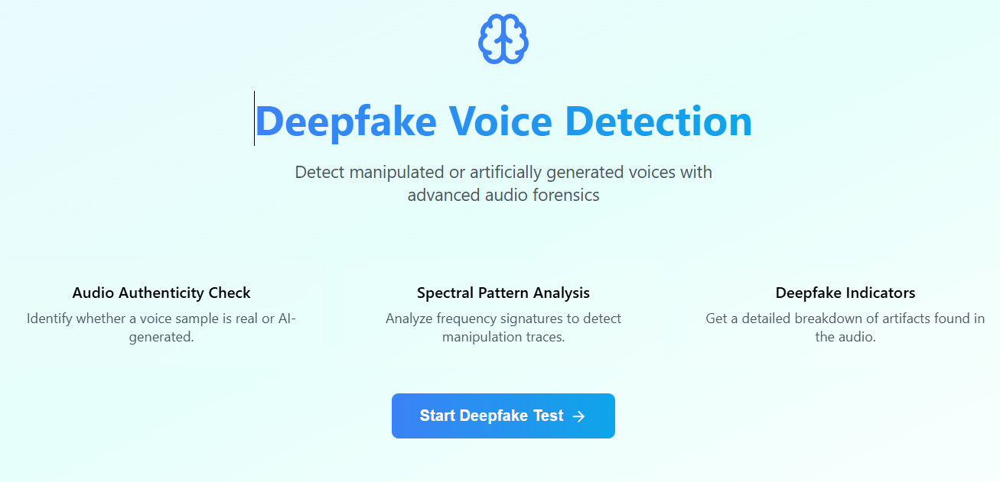 | 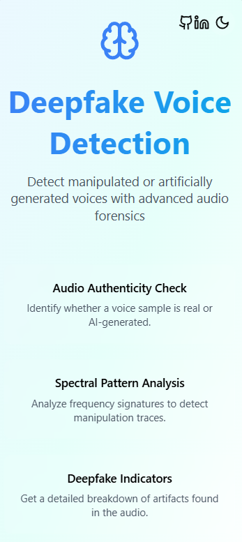 |

| Web — Upload | Mobile — Upload |
|--------------|----------------|
| 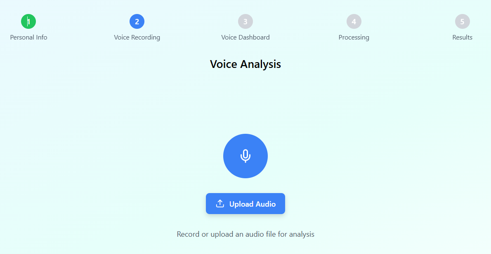 | 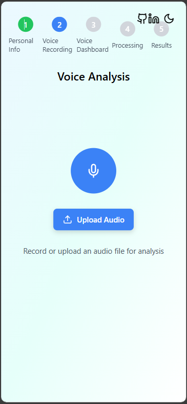 |

### User Information

| Web — User Info | Mobile — User Info |
|----------------|--------------------|
| 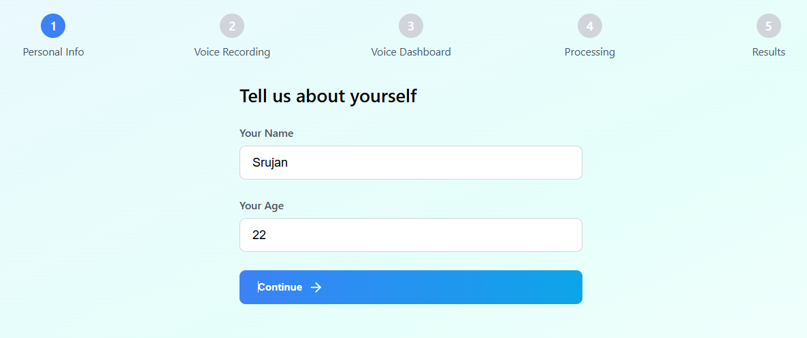 | 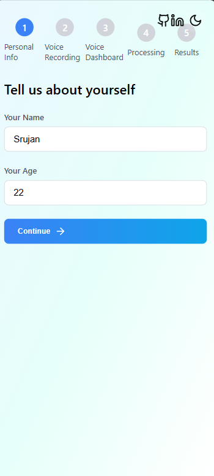 |

### Analysis & Results

| Web — Analysis | Mobile — Analysis |
|---------------|------------------|
| 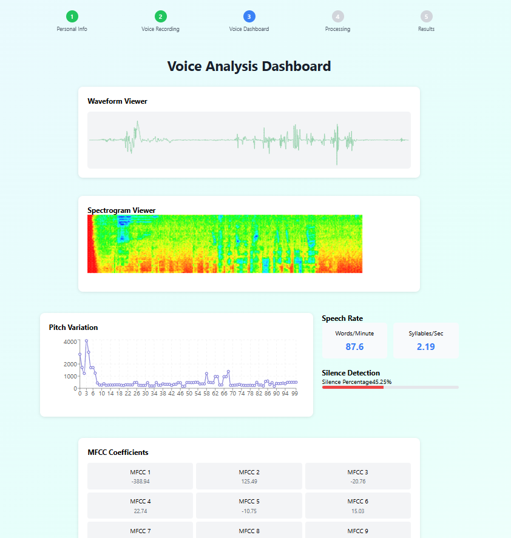 | 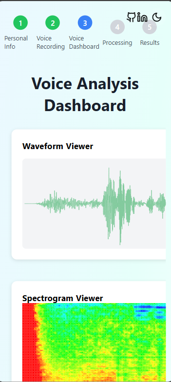 |

| Web — Result | Mobile — Result (1) | Mobile — Result (2) |
|-------------|---------------------|---------------------|
| 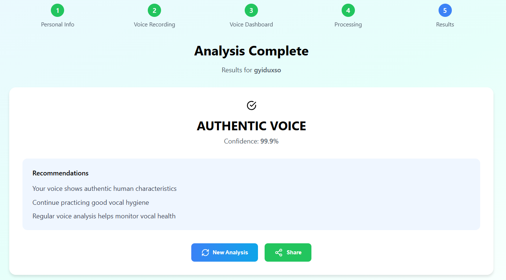 | 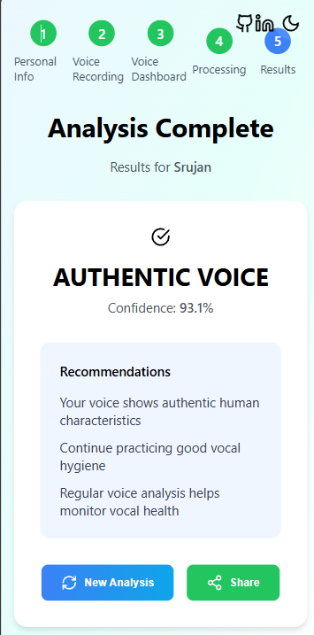 | 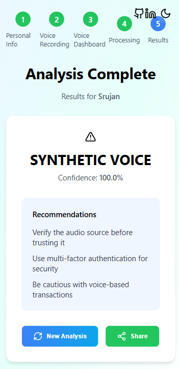 |

---

## Repository Structure

```
fakeifi_deepfake_voice_detection_pipeline/
├── app.py
├── voice_analysis.py
├── voice_model.py
├── requirements.txt
├── LICENSE
├── README.md
├── assets/
│   └── ui/
│       └── web/
├── models/
│   └── label_encoder.joblib
└── saved_models/
    └── SceneFake_CNN_SMOTE.h5
```

---

## Installation

```bash
# Clone the repository
git clone https://github.com/Srujanrana07/FakeIFi_Deepfake_voice_Detection_pipeline.git
cd FakeIFi_Deepfake_voice_Detection_pipeline

# Install Python dependencies
pip install -r requirements.txt

# Start the backend server
python app.py

# Frontend (if applicable)
npm install
npm run dev
```

---

## Demo

A live demo and walkthrough of FakeIFi is available on request. The demo covers:

- End-to-end audio upload and classification flow
- Confidence score output and forensics visualizations
- Mobile and desktop UI walkthrough

To request a demo or review the frontend, contact via email below.

---

## Limitations

- Evaluation is limited to the SceneFake benchmark; cross-dataset generalization has not been validated.
- Some degree of overfitting was observed during CNN training.
- No adversarial defense mechanisms are implemented.
- The system is a research prototype and has not been evaluated in production environments.

---

## References

Dataset, architecture details, evaluation metrics, and related research are documented in the companion repository:

[https://github.com/Srujanrana07/DeepFake-Voice-Detection](https://github.com/Srujanrana07/DeepFake-Voice-Detection)

---

## Contact

**Email:** srujanrana204@gmail.com

For frontend access, demo requests, or collaboration inquiries, reach out via email.
